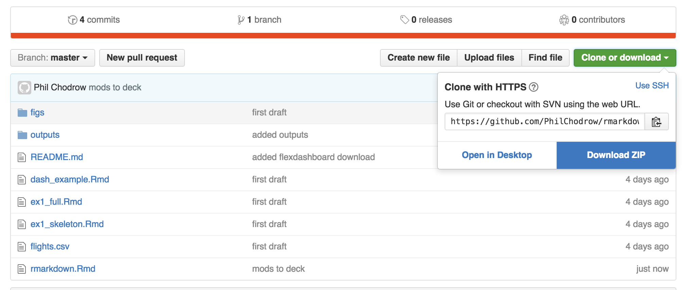
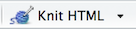

# Two Perspectives on Literate Programming with R Markdown

Training materials for a 60 minute session on reproducible analysis and deliverables using R Markdown. Includes slides, exercises, and examples. 

## 1. Update R

Please go to [CRAN](https://cran.r-project.org/) and download the latest version of R. **You need at least version 3.3.0 to follow along with the exercises**. To check if you are running the right version, open up RStudio and look at the first line of the greeter message: it should say `R Version 3.3.0.` 

## 2. Install Packages

```{r}
pkgs <- c('knitr', 'rmarkdown', 'dplyr', 'ggplot2', 'readr', 
          'lubridate', 'tidyr', 'nycflights13', 'httpuv', 
          'jsonlite', 'shiny', 'htmlwidgets')
install.packages(pkgs)
install.packages('flexdashboard', type = 'source')
```

You can install these packages by opening RStudio, copying and pasting the code above into the console, and hitting "Enter".

## 3. Download Session Files

To obtain these materials, use git if you are comfortable, or do this: 



Unzip the downloaded directory and save it somewhere where you will find it again easily. 

## 4. Check Your Setup

Open the file `ex1_skeleton.Rmd` in the downloaded directory, and `knit` it by clicking  in RStudio. RStudio may prompt you to install additional packages; click 'OK'. If the packages install successfully and a document appears without errors, you are good to go. If an error appears telling you that you need to install a package, attempt to install it. If that doesn't resolve the issue, shoot me an email with a screenshot of your error message. 
