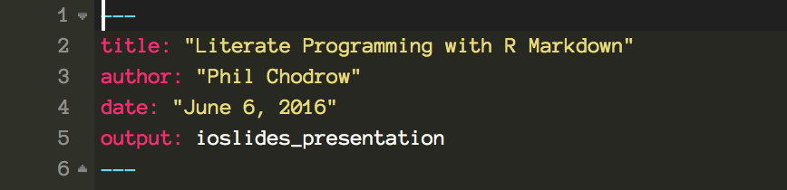
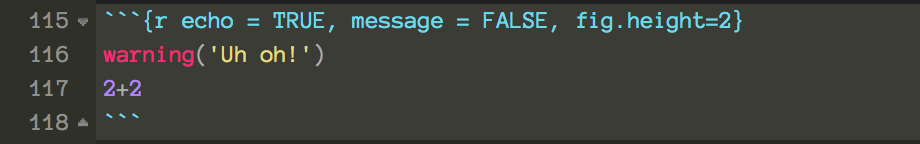

## Goal + Outline

**Goal:** By the end of this session, you will: 

1. Be familiar with the paradigm of *literate programming*.
2. Possess an operational, elementary, R-based toolbox for literate programming.  
3. Know how and where to learn more. 

### **Session Outline**: 

1. Literate Programming
2. R + Markdown = R Markdown
3. Components of R Markdown (+ Exercises)
4. First peak at dashboards

# Two Perspectives on Literate Programming

## Literate Programming

*"Yet to me, **literate programming is certainly the most important thing** that came out of the TeX project... Literate programming is what you need to rise above the ordinary level of achievement."*   -- Donald Knuth

*Literate programming* breaks down the barrier between code and commentary by allowing you to write both at the same time, as part of the same workflow, in the same document.  

Two things to write about: the **process** by which you obtained your results, or the **significance** of the results themselves. 

## Process and Reproducibility

*Reproducible* analysis is:

- Portable
- Well-documented
- Maximally automated

A carefully-documented literate program is a powerful tool of reproducibility: anyone can use your program to accomplish new tasks, while clearly understanding your work (since your commentary walks them through it). 

## Significance and Reporting

Literate programming can also make it easy to construct reports: 

- Instead of documenting what you did...
- Document what the audience should learn from your results. 

Note: if you do this, you should find other ways (comments, package documentation) to document your process. 

# R + Markdown = R Markdown

## Markdown handles 'normal writing'

*"Markdown is a text-to-HTML conversion tool for web writers. Markdown allows you to write using an easy-to-read, easy-to-write plain text format, then convert it to structurally valid XHTML (or HTML)."* - [John Gruber](https://daringfireball.net/projects/markdown/), author of Markdown.

That sounds complicated, but **in practice, Markdown is fantastically simple:** [Let's try it](http://dillinger.io/). 


## R Markdown {.flexbox .vcenter}

R Markdown implements the literate programming paradigm by allowing you to write **prose in Markdown**, interspersed with **R code, output, and plots.** 

```{r, out.width = 500, fig.retina = NULL, echo = FALSE}
knitr::include_graphics("https://rstudioblog.files.wordpress.com/2014/06/storms2-001.png")
```

R Markdown is incredibly flexible: you can write reports, dashboards, blog posts, and presentations (like this one!) quickly and easily. 

## Pros and Cons of (R)Markdown

Pros: 

- Focus on your content by letting the Markdown --> HTML conversion software handle the formatting. 
- Obtain high quality documents for very little work. 
- Write and document in the same place you code. 
- Share them freely: RMarkdown documents don't store their data.

Cons: 

- Full customization requires HTML and CSS. 
- Lots of moving parts that could break. Usually they don't: RStudio does a good job managing behind-the-scenes. 

# Components of R Markdown (+ Exercises)

## Overview

```{r, out.width = 500, fig.retina = NULL, echo = FALSE}
knitr::include_graphics("http://image.slidesharecdn.com/reprotalk-151006140137-lva1-app6891/95/reproducible-research-and-literate-programming-in-r-8-638.jpg?cb=1444140436")
```

We're going to focus on the YAML frontmatter and working with code chunks -- not Markdown or the R code itself.  

## YAML is your Document's Identity

```{r, out.width = 500, fig.retina = NULL, echo = FALSE}

```

Includes global options like: 

- Title, author, date
- The output format of your document (.html, .pdf, slides, dashboard, etc.)
- Appearance options (themes)
- Parameters (more on this soon)

## Exercise 1 {.smaller}

1. You can make new RMarkdown files by selecting `File` -> `New File` -> `R Markdown` in RStudio. But today, we are going to work with the skeleton file, `ex1_skeleton.rmd`. Open this file now. 
2. Click   at the top of your workspace and inspect the output. 
3. Change the `YAML` header to match the following, and re-knit. Indentation is important! 

``` yaml
---
title: "Data Cleaning Example"
author: "Your Name"
date: "June 6, 2016"
### <b>
output: 
  html_document:
    theme: flatly
    toc: true
### </b>
---
```

You've changed two lines. In English, what does each line do? 

## Code Chunks Perform Computations

An R code chunk includes **R code** and **chunk options** that determine how to display the output of that code. Here's an example from my .Rmd file....

```{r, out.width = 500, fig.retina = NULL, echo = FALSE}

```

...and here's what happens when that runs. 

```{r echo = TRUE, message = FALSE, fig.height=2}
warning('Uh oh!')
2+2 
```

## Exercise 2: Code Chunks

1. The code chunk titled `read_data` in `ex1_skeleton.Rmd` needs fixing, since it's not currently reading any data.  Fix it using the `read_csv()` function. The data is in `flights.csv`. 
2. The code chunk titled `libraries` is printing out a bunch of ugly messages when we knit. Add `warning = FALSE` to the chunk options to suppress this behavior. 

## Exercise 3: Inline Code

You can mix inline R code with sentences like this: today is ```r Sys.Date()```.

There are three places marked with **BOLD INSTRUCTIONS** for you to practice using inline R code. It will be easiest to look at the examples that already exist in the code and modify them. 

## Parameterized Reports Save Time and Errors

Suppose you'd like to run the same report repeatedly for different subgroups: e.g. service locations, geographic regions, customer demographics, etc. 

Instead of changing all your code, just **parameterize** your document. 

## Exercise 4: Parameterizing Reports

Add the bolded code to the YAML frontmatter in `ex1_skeleton.rmd`:
``` yaml
---
title: "Your title"
author: "Your Name"
date: "June 6, 2016"
output: html_document
### <b>
params: 
  begin: "2013-04-01"
  end: "2013-09-15"
### </b>
---
```

The result of the YAML is that the variable ```params$begin``` is now equal to ```"2013-04-01"```, etc. This work had been being done by the messy code block  titled `params`. Delete it! 

## Lots of options....

In some of the resources I've included at the end of this deck, you can learn things like: 

- More chunk options: how to show or hide your code
- How to add tabs to your reports
- How to work with figures and control how they display
- ...

For example, [here](ex1_fancier.html) is a slightly fancier version of the exercise we just completed. 

Instead of going into these details, let's illustrate how RMarkdown can be used to construct attractive deliverables. The `html_document` type can be used for this, but let's talk about...

# Dashboards

## `flexdashboard`

Use the flexibility of Markdown and the computational power of R to **easily construct attractive dashboards.** 

Here's a [simple dashboard](dash_example.html) with the same data set about New York City flights. 

What impressed me: 

- Compiles in seconds, crunching ~300,000 rows of data along the way
- Easy to write: what you see reflects ~1 hour of work on my end. 
- Looks decent! 

## `flexdashboard` is RMarkdown!

What's cool about this is that a Flex dashboard is **just another RMarkdown document**. its ingredients are:

- YAML
- Markdown
- R code chunks with chunk options

These are things you already know how to use! Let's take a look at the [source](dash_example.Rmd).

Learn more about `flexdashboard` in the resources at the end of this deck. 

# Further Resources

## Creating a `flexdashboard`

Install `flexdashboard` by running
```{r eval=FALSE}
install.packages('flexdashboard', type = "source")
```

<div class="columns-2">

```{r, out.height = 300, fig.retina = NULL, echo = FALSE}
knitr::include_graphics("http://rmarkdown.rstudio.com/flexdashboard/images/NewRMarkdown.png")
```


Open up a new dashboard by going to `File` -> `New File` -> `RMarkdown` -> `From Template` -> `Flex Dashboard`, and then choose `OK`.

</div>


## Misc. links

- RMarkdown [website](http://rmarkdown.rstudio.com/index.html)
- RMarkdown [cheatsheet](https://www.rstudio.com/wp-content/uploads/2015/02/rmarkdown-cheatsheet.pdf)
- [Documentation](http://rmarkdown.rstudio.com/flexdashboard/) for `flexdashboard`
- John Gruber's original Markdown [syntax specification](https://daringfireball.net/projects/markdown/syntax)
- [Dillinger](http://dillinger.io/), a convenient online tool for practicing writing in Markdown (not that you need much practice) 

## What's going on behind the scenes? 


1. The R package `knitr` transforms  `report.rmd` and your inputs (like data) into  `report.md` file by running all your R code and stitching everything together. 
2. The flexible document processor `pandoc` transforms `report.md` into `report.html`, which is the viewable, shareable version. HTML formats include reports, slides like these, and `flexdashboard`. 
3. If you ask it nicely, `pandoc` can also transform `report.md` into attractive .pdf, or even .docx formats! 

